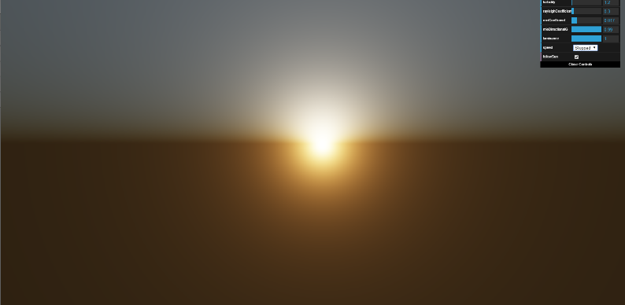
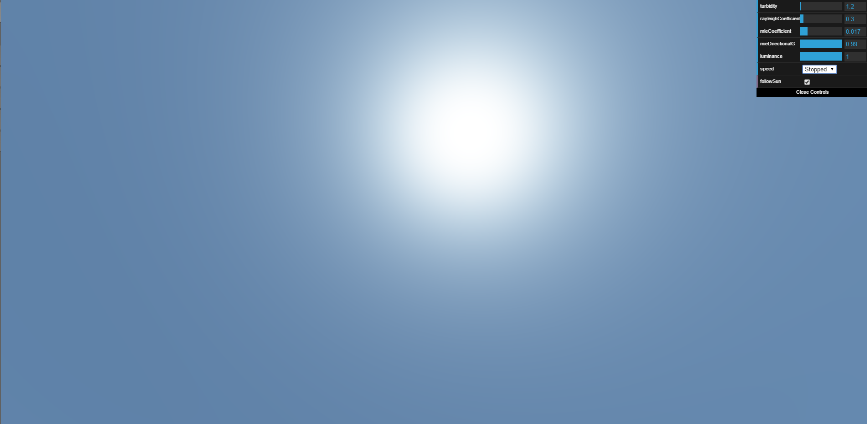

# Atmospheric Scattering in three.js

> [!WARNING]
> Archived and no longer maintained; kept for reference. Written in fall 2014 against the three.js release bundled in `js/lib/` (WebGL 1), and not tested in current browsers.

- [Atmospheric Scattering in three.js](#atmospheric-scattering-in-threejs)
  - [Overview](#overview)
    - [What it does](#what-it-does)
  - [Screenshots](#screenshots)
  - [Running it](#running-it)
  - [What's in here](#whats-in-here)
  - [Credits](#credits)

## Overview

A three.js scene with a sky dome and a rising and setting sun, colored by a shader that models Rayleigh and Mie scattering.

Project 1 for CSCI 441, a graduate computer graphics course at the University of Montana, fall 2014. I started by working through Joshua Koo's three.js sky shader, then reworked it by implementing the real-time scattering equations from Preetham, Shirley, and Smits and from Hoffman and Preetham.

**Tech:** JavaScript, three.js, GLSL, dat.GUI

### What it does

- Renders the sky's color from Rayleigh scattering (air molecules; why the sky is blue and sunsets are red) and Mie scattering (haze; why the sky whitens near the horizon)
- Animates the sun rising and setting at a slow or fast speed, or stops it so you can set its height yourself, with an option for the camera to follow the sun
- Exposes the model's parameters as sliders: turbidity, the Rayleigh and Mie coefficients, Mie directionality, and luminance
- Includes a small set of unit tests in `tests/`

## Screenshots





## Running it

Serve the folder and open it in a browser:

```bash
python3 -m http.server
```

Then open <http://localhost:8000>. The unit tests are at <http://localhost:8000/tests/>.

`index.html` loads `js/skyScene.js`, but the file is named `js/SkyScene.js`. That works on case-insensitive file systems (Windows, and macOS by default) but not on Linux.

## What's in here

| Path | What it is |
|---|---|
| `index.html`, `js/SkyScene.js` | The scene, sun animation, and UI |
| `js/SkyShader.js`, `shaders/` | The sky vertex and fragment shaders |
| `tests/` | Unit tests for the scene |
| `Gross_Angela_Project_1_Paper.pdf` | The project paper: the scattering model, implementation, and references |
| `Gross_Angela_Project_1_Presentation.pptx` | The class presentation |

## Credits

- [three.js](https://github.com/mrdoob/three.js), [dat.GUI](https://github.com/dataarts/dat.gui), [tween.js](https://github.com/tweenjs/tween.js), jQuery, and sprintf.js are bundled in `js/lib/` under their own licenses
- Starting point: Joshua Koo's [three.js sky shader example](https://threejs.org/examples/#webgl_shaders_sky)
- Scattering model: A. J. Preetham, Peter Shirley, and Brian Smits, *A Practical Analytic Model for Daylight*; Naty Hoffman and A. J. Preetham, *Rendering Outdoor Light Scattering in Real Time*
- Also informed by Simon Wallner's atmospheric scattering work; the full reference list is in the paper
